<!-- Generated by GitHub Profile Agent Console. Edit profile.config.json, then run npm run generate. -->

  <picture>
    <source media="(max-width: 760px) and (prefers-color-scheme: dark)" srcset="./assets/hero/agent-console-2e7bc60d-mobile-dark.svg">
    <source media="(max-width: 760px)" srcset="./assets/hero/agent-console-2e7bc60d-mobile-light.svg">
    <source media="(prefers-color-scheme: dark)" srcset="./assets/hero/agent-console-2e7bc60d-dark.svg">
    <source media="(prefers-color-scheme: light)" srcset="./assets/hero/agent-console-2e7bc60d-light.svg">
    
  </picture>

  

## About Me

I am an AI/ML engineer focused on building practical machine learning systems with Python.

I enjoy working with data, from SQL and Excel to Power BI, and turning it into models and tools that are useful.

## Current Focus

| Area | What I am exploring |
| --- | --- |
| **Machine Learning** | Building and evaluating models with Python. |
| **Data Analysis** | Working with SQL, Excel, and Power BI to understand data. |
| **Applied AI** | Turning model capabilities into useful software. |

## Research Direction

I am interested in turning data into dependable machine learning systems that are tested, measured, and useful in real work.

## Tech Stack

`Python` · `SQL` · `Excel` · `Power BI`

## Recent Activity

<!-- AUTO:ACTIVITY:START -->
- Oct 3, 2026: pushed 1 commit to [Dhairyapatel1mc/Dhairyapatel1mc](https://github.com/Dhairyapatel1mc/Dhairyapatel1mc).
- Oct 3, 2026: created a branch in [Dhairyapatel1mc/Dhairyapatel1mc](https://github.com/Dhairyapatel1mc/Dhairyapatel1mc).
- Sep 30, 2026: pushed 1 commit to [Dhairyapatel1mc/PR-2-Supervised-Learning-](https://github.com/Dhairyapatel1mc/PR-2-Supervised-Learning-).
- Sep 30, 2026: pushed 1 commit to [Dhairyapatel1mc/timepass-](https://github.com/Dhairyapatel1mc/timepass-).
- Sep 30, 2026: created a branch in [Dhairyapatel1mc/PR-2-Supervised-Learning-](https://github.com/Dhairyapatel1mc/PR-2-Supervised-Learning-).
- Sep 30, 2026: created a branch in [Dhairyapatel1mc/timepass-](https://github.com/Dhairyapatel1mc/timepass-).
<!-- AUTO:ACTIVITY:END -->

---

  Building thoughtful AI systems and sharing what works.

